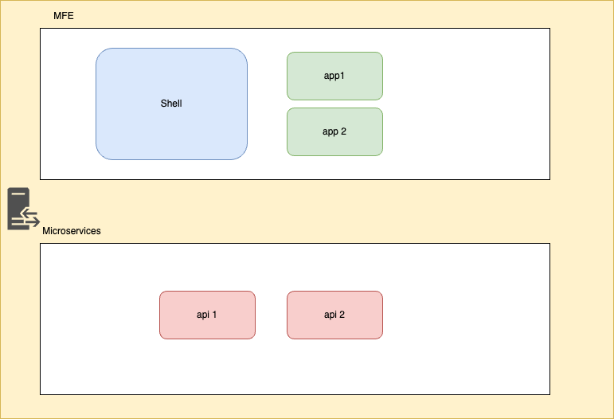

# Main


✨ **This workspace has been generated by [Nx, Smart Monorepos · Fast CI.](https://nx.dev)** ✨



# Description

This template uses MFE, Microservices, Libs, and deployment. It requires a Mongo database, which it is included in this repository

# Commands

## Isolated Environment
To start the docker-compose dev env:

```sh
docker-compose up
```

## Dev Env

- To start the docker-compose database for dev:
```sh
docker-compose --file docker-compose-dev.yml up
```
- Start the Management API
```sh
pnpm nx run main-api:serve
```

- Start the Management and Shell APP
```sh
pnpm nx run main-app:serve
```


# Project Structure

## Main
- Angular Management App and Shell
```sh
apps/main/app/
```
- Management Api
```sh
apps/main/api/
```
## Libs
- Auth Api
```sh
libs/auth-api
```
- Base UI
```sh
libs/base-ui
```


## Integrate with editors

Enhance your Nx experience by installing [Nx Console](https://nx.dev/nx-console) for your favorite editor. Nx Console
provides an interactive UI to view your projects, run tasks, generate code, and more! Available for VSCode, IntelliJ and
comes with a LSP for Vim users.


## Running tasks


To execute tasks with Nx use the following syntax:

```
pnpm nx run <target> <project> <...options>
```

You can also run multiple targets:

```
pnpm nx run-many -t <target1> <target2>
```

..or add `-p` to filter specific projects

```
pnpm nx run-many -t <target1> <target2> -p <proj1> <proj2>
```

Targets can be defined in the `package.json` or `projects.json`. Learn more [in the docs](https://nx.dev/features/run-tasks).


# MFE Configuration Structure

## How to Add it to Shell

Use the management app and add a new entry in the `mfe-configuration` route:

```json
 {
        "code": "feed", // unique code - string
        "route": "feed", // route for angular
        "description": "description", // description
        "module": "./ExternalFeedModule", // module exposed from Remote App
        "url": "http://localhost:4202/remoteEntry.mjs", // location of the Remote App
        "configuration": {}, // configuration to be injected in the Remote App
        "name": "feed", // unique name for the Remote App
        "label": "feed", // label for route
        "moduleClass": "RemoteEntryModule" // exposed class name from Remote App
    }
```
## How to Expose an App

 - Create an Angular Module
 - Anotate all the required modules, if possible use the same for all the global application
 ```js

import { NgModule } from '@angular/core';
import { CommonModule } from '@angular/common';
import { RouterModule } from '@angular/router';

import { RemoteEntryComponent } from './entry.component';
import { NxWelcomeComponent } from './nx-welcome.component';

@NgModule({
  declarations: [RemoteEntryComponent, NxWelcomeComponent],
  imports: [
    CommonModule,
    RouterModule.forChild([
      {
        path: '',
        component: RemoteEntryComponent,
      },
    ]),
  ],
  providers: [],
})
export class RemoteEntryModule {}

 ```
 - Add the information in the webpack file 

 ```js
....
  new ModuleFederationPlugin({
      name: 'main-app',
      library: { type: 'module' },
      filename: 'remoteEntry.mjs', // name of the file 
      exposes: {
        './RemoteEntryModule': // how the module will be exposed
          'apps/main/app/src/app/remote-entry/entry.module.ts', // path to module
      },
      shared: share({   // shared dependencies
        '@angular/core': {
          singleton: true,
          strictVersion: true,
          requiredVersion: 'auto',
          eager: true,
        },
        '@angular/common': {
          singleton: true,
          strictVersion: true,
          requiredVersion: 'auto',
          eager: true,
        },
        '@angular/common/http': {
          singleton: true,
          strictVersion: true,
          requiredVersion: 'auto',
          eager: true,
        },
        '@angular/router': {
          singleton: true,
          strictVersion: true,
          requiredVersion: 'auto',
          eager: true,
        },
        ...sharedMappings.getDescriptors(),
// you can learn more here : 
https://www.angulararchitects.io/en/blog/micro-frontends-with-modern-angular-part-1-standalone-and-esbuild/
 ```
## Deployment of Packages

For the deployment, you need to uncomment the deployment actions and copy the deployment scripts from either hits or smartirb. Also, you would need to contact the DevOps team to create a cluster ( eks or aks) 

```sh
https://github.com/jamilomar/mfe-template/blob/main/.github/workflows/release.yaml#L65
```

Add access to the repo to consume the hits-docker-base-web ( you could create a new base image)
```sh
 https://github.com/orgs/jamilomar/packages/container/hits-docker-base-web/settings
 ```
Verify the name of the packages in each of the library packages, use unique names, and set the `private` flag to false ( this will allow the package to be deployable) 
For consuming the libraries, you will need to provide access to each of the packages at the package inside the repo. Each client must set up the GITHUB_TOKEN var with its own PAT Token. 

## Explore the project graph

Run `pnpm nx graph` to show the graph of the workspace.
It will show tasks that you can run with Nx.

- [Learn more about Exploring the Project Graph](https://nx.dev/core-features/explore-graph)

